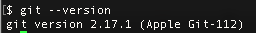
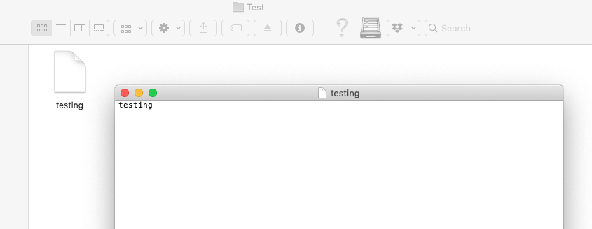
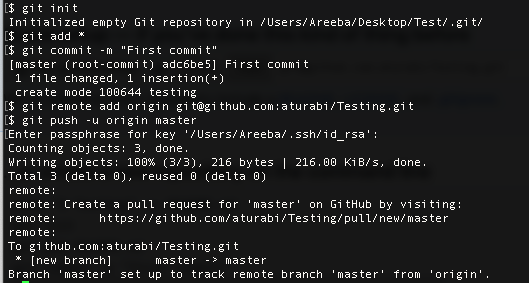
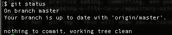
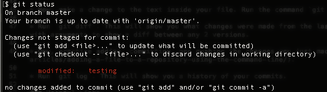
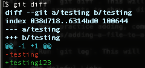
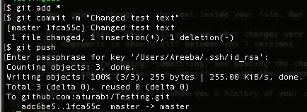
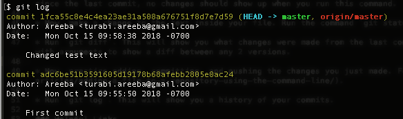
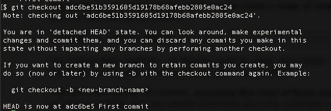

# How To Git Good at Git

## About
    
* **Git**- Git is a version-control system for tracking changes in files and coordinating work on those files among multiple people. Think of it as a path of snapshots of your files at different points in their history, in the order in which each of these snapshots were created. Git is purely local (on your machine).

* **Github**- web-based hosting service for version control using Git. Think of it as a website where you can create and collaboratively use a Git repository. When you push your changes to Github, your changes can be seen by the rest of your team (not local).

* Some examples of other web-based hosting services for git: [Bit Bucket](https://bitbucket.org/) and [Git Lab](https://about.gitlab.com/)

### Why Use Git?

* Versioning: Allows for multiple versions of software (different releases/platforms/versions)

* History: Can see all history of project and easy access to old versions

* Accountability: each change to project is marked with a commit message and a developer who made the commit

## Installation/Setup

**Install git:**

* [Install link](https://git-scm.com/downloads)

* Once installed, check to see if install worked by running `git --version`.

    

* If git is not recognized, check to see if it was installed (find Git folder on your machine). On Mac, it is generally under /usr/bin or /usr/local/git. On Windows, C:\Program Files(x86)\Git\bin.

* If it is installed, but not being recognized, you may need to set your PATH environment variable (this is where your terminal will look to find executables, like git, to run) to include the directory where the git executable is. Read more [here](https://stackoverflow.com/questions/26620312/installing-git-in-path-with-github-client-for-windows). [Here](https://superuser.com/questions/284342/what-are-path-and-other-environment-variables-and-how-can-i-set-or-use-them) is more information on PATH and how to set environment variables.

**Set up SSH Key:** Set up to use SSH protocol to connect to Github and authenticate, so typing out username and password is not necessary for every connection.

* [What are SSH Keys?](https://winscp.net/eng/docs/ssh_keys) Authentication based on public-key cryptography (uses public and private key).

* [SSH Key Setup for Github](https://help.github.com/articles/generating-ssh-keys/).

**Get Github Student Pack:** Contains useful tools for free for students. For example, this allows you to create private repositories for free. [Public vs. private repositories](https://help.waffle.io/github-basics/public-vs-private-repos-in-github).

* [Github Student Pack](https://education.github.com/pack).

## Getting Started

### Mini Tutorial

* To start learning, create a folder with a simple text file. I created a folder called Test, containing test.txt.

    

* Then, follow [these steps](https://help.github.com/articles/adding-an-existing-project-to-github-using-the-command-line/) to create a Github respository for your folder.

    

* Run the command `git status`. This command shows modified files in your working directory. Since no changes have been made since the last commit, no changes should show up when you run this command.

    

* Now, make a change to the text inside your file. Run the command `git status` again. The file has been changed!

    

* Run `git diff`. This will show you what changes were made from the last commit. `Git diff` can be used with arguments to show a diff between any 2 versions. Here, you can see that I changed "testing" to "testing123" on line 1. The addition is in green, and deletions are in red.

    

* Now, practice adding, committing, and pushing the changes you just made. Follow [these steps](https://help.github.com/articles/adding-a-file-to-a-repository-using-the-command-line/).

    

* Run `git log`. This will show you a history of your commits, along with the commit message that went with each of them.

    

* Now, let's say I want to use a previous version of my project. I can checkout this version using `git checkout [revision]`.
where [revision] is the commit hash (for example, my first commit's hash according to the output of git log: adc6be51b3591605d19178b68afebb2805e0ac24). Open up your test file: it should be the same as when you first created it (its state at the commit you checked out).

    

* This was a very basic tutorial of some of the functionalities of Git: keep exploring using the links below! 

### Helpful Links

* [How Git works](https://git-scm.com/book/en/v2/Getting-Started-Git-Basics).

* [Git cheat sheet](https://education.github.com/git-cheat-sheet-education.pdf).

